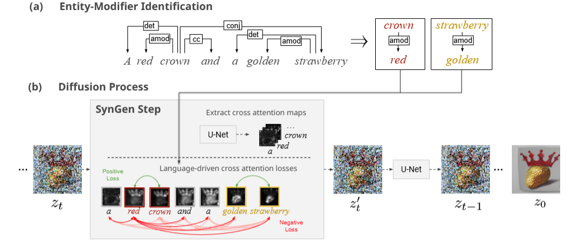

- Đọc bài báo:

    Diffusion models for text-conditioned image generation produce impressive realistic images [1, 2, 3 , 4 ]. Users control the generated content through natural-language text prompts that can be rich and complex. Unfortunately, in many cases the **[P] generated images are not faithful to the text prompt** [5, 6]. Specifically, one very common failure mode results from **[P] improper binding, where modifier words fail to influence the visual attributes of the entity-nouns to which they are grammatically related**.

    As an illustration, consider the prompt “a pink sunflower and a yellow flamingo”. Given this prompt, current models often confuse the modifiers of the two entity-nouns, and generate an image of a yellow sunflower and a pink flamingo (Fig. 1, bottom left, semantic leak in prompt). In other cases, the attribute may semantically leak to areas in the image that are not even mentioned in the prompt (Fig. 1, bottom center, semantic leak outside prompt) or the attribute may be completely neglected and missed from the generated image (Fig. 1, bottom right, attribute neglect). Such mismatch can be addressed by providing non-textual control like visual examples [ 7, 8], but the problem of correctly controlling generated images using text remains open.

    **[W] A possible reason** for these failures is that **[W] diffusion models use text encoders like CLIP [9], which are known to fail to encode linguistic structures** [10]. This makes the diffusion process “blind" to the linguistic bindings, and as a result, **[W] generate objects that do not match their attributes**. Building on this intuition, we propose to make the generation process aware of the linguistic structure of the prompt. Specifically, we suggest to intervene with the generation process by steering the cross-attention maps of the diffusion model. These **cross-attention map** serve as a **link between prompt terms and the set of image pixels** that correspond to these terms. Our linguistics-based approach therefore aims to generate an image where the visual binding between objects and their visual attributes adheres to the syntactic binding between entity-nouns and their modifiers in the prompt.

    Several previous work devised solutions to improve the relations between prompt terms and visual components, with some success [ 11 , 12, 13 ]. They did not focus on the problem of modifier-entity binding. Our approach specifically addresses this issue, by constructing a novel **loss function that quantifies the distance between the attention patterns of grammatically-related (modifier, entity-noun) pairs, and the distance between pairs of unrelated words** in the prompt. We then optimize the latent denoised image in the direction that separates the attention map of a given modifier from unrelated tokens and bring it closer to its grammatically-related noun. We show that by intervening in the latent code, we markedly improve the pairing between attributes and objects in the generated image while at the same time not compromising the quality of the generated image.

    We evaluate our method on three datasets. 
    - (1) For a natural-language setting, we use the natural compositional prompts in the ABC-6K benchmark [ 13 ]; 
    - (2) To provide direct comparison with previous state-of-the-art in [11 ], we replicate prompts from their setting; 
    - (3) Finally, to evaluate binding in a challenging setting, we design a set of prompts that includes a variety of modifiers and entity-nouns. On all datasets, we find that SynGen shows significant improvement in performance based on human evaluation, sometimes doubling the accuracy. Overall, our work highlights the effectiveness of incorporating linguistic information into text-conditioned image generation models and demonstrates a promising direction for future research in this area.

    The main contributions of this paper are as follows: (1) A novel method to enrich the diffusion process with syntactic information, using inference-time optimization with a loss over cross-attention maps; (2) A new challenge set of prompts containing a rich number and types of modifiers and entities.

    - Ghi chú:
        - modifier: miêu tả đặc tính cụ thể của đối tượng
        - noun: đối tượng chhín
        - entity = term = modifier + noun

---

    

- Bảng tóm tắt:

    | Paper                                  | Hội nghị | Tóm tắt                                                                                                                                                                                                                                                              | Nhận xét |
    |:---------------------------------------|:-----------|:-----------------------------------------------------------------------------------------------------------------------------------------------------------------------------------------------------------------------------------------------------------------------|:-----------|
    | Linguistic Binding in Diffusion Models | 2023       | - Problem: Attribute Binding thất bại. - Why: Model encoder CLIP không hiểu cấu trúc ngữ nghĩa (Assumption). - Solution: Xây dựng hàm loss đại diện khoảng cách giữa các cặp từ có quan hệ ngữ pháp và các cặp từ không liên quan. | Chậm      |

- Cụ thể Solution:
    - Xây dựng hàm Loss như sau:

        $$L = L_{pos} + L_{neg} = \sum_{i=1}^{k} \sum_{(m,n) \in P(S_i)} \text{dist}(A_m, A_n) - \sum_{i=1}^{k} \frac{1}{|U(S_i)|} \sum_{(m,n) \in P(S_i)} \sum_{u \in U(S_i)} \frac{1}{2} \left( \text{dist}(A_m, A_u) + \text{dist}(A_u, A_n) \right)$$

        - **Trong đó:**

            - $\{S_1, S_2, \dots, S_k\}$: Tập hợp các nhóm token được trích xuất từ thuật ngữ trong câu gốc.
            - $P(S_i)$: Tập hợp các cặp (modifier, entity-noun) riêng lẻ trong nhóm $S_i$.
            - $\{A_1, A_2, \dots, A_N\}$: Bản đồ chú ý (attention maps) của $N$ token trong câu gốc.
            - $U(S_i)$: Tập hợp các token không liên quan về mặt ngữ pháp trong nhóm $S_i$.
            - $\text{dist}(\cdot)$: Hàm đo lường khoảng cách giữa các vector chú ý.

        - Trong paper này người ta dùng hàm $\text{dist}(\cdot)$ là KL Divergence để đo khoảng cách giữa các Attention Map:
                
            $$\text{dist}(A_i, A_j) = \frac{1}{2} D_{KL}(A_i \parallel A_j) + \frac{1}{2} D_{KL}(A_j \parallel A_i)$$

            - Vì các Attention Map ($A_i, A_j$) sau khi chuẩn hóa bản chất là các phân phối xác suất (probability distributions) trên không gian pixel, nó thỏa:

                - Mọi giá trị đầu ra đều nằm trong khoảng $(0, 1)$.

                - Tổng tất cả các giá trị bằng 1.

    - Đưa hàm loss vào **quá trình cập nhật vector z** (SynGen step) trong quá trình suy luận:

        

        
        
