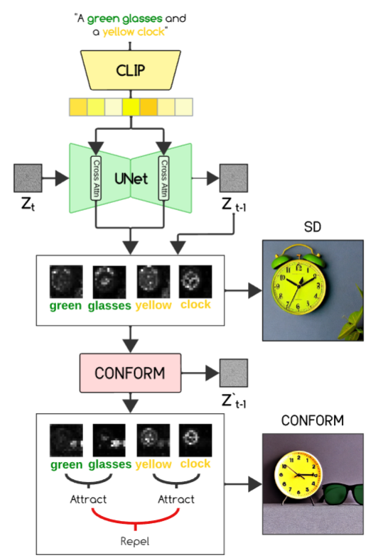

- Đọc bài báo:

    Diffusion text-to-image models [15] have showcased remarkable progress in generating images using textual cues [33, 34, 37]. These models offer a wide set of capabilities, ranging from image editing [2, 3, 9, 13, 29, 42], personalized content creation [36], and inpainting [25]. However, images produced by these models might not always faithfully represent the semantic intent of the given text prompt [6, 39].

    Notable semantic discrepancies in models like Stable Diffusion [34] and Imagen [37] include:

    - **Missing objects**: the model might overlook or entirely fail to produce certain objects.
    - **Attribute binding**: the model might mistakenly link attributes to the wrong subjects [6].
    - **Miscounting**: the model fails to accurately produce the right quantity of objects [22, 48].

    Figure 2 illustrates these shortcomings in popular diffusion models, Stable Diffusion [34] and Imagen [37].

    For example, the output might neglect certain subjects, as in the prompt *“a bear and an elephant”*, where the bear is ignored as depicted in Fig. 2(a). Additionally, the model might mix up attributes, such as confusing colors in the prompt *“a purple crown and a yellow suitcase”* as seen in Fig. 2(b).

    Another behavior often attributed to the imprecise language comprehension of the CLIP text encoder [28, 30] is the failure to produce the correct quantity of subjects. In Fig. 2(c), for the prompt *“one dog and two cats”*, the model either produces too many cats (Stable Diffusion) or fails to include one cat (Imagen).

    Recent studies proposed various solutions to these semantic challenges [1, 6, 20, 22, 45]. For example:

    - Chefer et al. [6] optimize cross-attention maps to encourage object presence.
    - Li et al. [22] use a dual loss function to segregate the attention map into distinct areas and reinforce attribute association.
    - Kim et al. [20] enhance fidelity by directly adjusting intermediate attention maps according to user-specified layouts.

    However, a common limitation of these methods is their reliance on tailored objective functions for each issue, leading to sub-optimal performance or challenges when dealing with complex prompts.

    Attention maps, which depict the relationship between the input text and the generated pixels, offer a valuable lens for understanding these challenges, as emphasized by prior research [1, 6, 13].

    For example:

    - In the prompt *“a bear and an elephant”*, a significant overlap is observed in the cross-attention maps dedicated to each subject (see Fig. 2(a)). This overlap makes it difficult to differentiate the two subjects and leads the model to produce only elephants.
    - In the prompt *“a purple crown and a yellow suitcase”*, the attentions designated for *purple* and *yellow* are misaligned, causing the model to mistakenly mix colors (see Fig. 2(b)).
    - For counting tasks, attention maps often concentrate on only one region (see Fig. 2(c), Imagen), resulting in an incorrect number of generated objects.

    Additionally, during the backward process, the attention maps corresponding to various attributes tend to scatter (see Fig. 3). Therefore, to effectively reduce scattering and ensure more focused and coherent attention allocation, we incorporated attention maps from the previous iteration. This enhances the model’s ability to maintain consistency across the generation process, as shown in Fig. 3.

    In this work, we tackle the challenge of high-fidelity generation in text-to-image models within a contrastive framework.

    This framework considers the attributes of a specific object as positive pairs while contrasting them against attributes and objects outside their pairing.

    For example, in the prompt *“a green dog and a white clock”* (see Fig. 1):

    - *green* and *dog* are treated as mutual positives.
    - *white* and *clock* become their contrastive counterparts, and vice versa.

    This approach separates distinct objects within the attention map, addressing overlapping attention, and encourages distinct high-response areas for each object and attribute.

    As a result:

    - Objects are distinctly separated from one another.
    - Attributes remain tightly associated with their corresponding objects.
    - The attention map effectively represents both concepts (see Fig. 1 and Fig. 2).

    **Key Contributions**

    - We propose a **training-free method** utilizing a contrastive objective combined with test-time optimization to enhance the fidelity of pre-trained text-to-image diffusion models.
    - Our approach is **model-agnostic**, applicable to popular text-to-image diffusion models like Stable Diffusion and Imagen.
    - Comprehensive experiments demonstrate the superiority of our method over baselines and competing approaches across benchmark datasets and user studies.

---

    

- Bảng tóm tắt:

| Paper                                  | Hội nghị | Tóm tắt                                                                                                                                                                                                                                  | Nhận xét                                             |
|:---------------------------------------|:-----------|:-------------------------------------------------------------------------------------------------------------------------------------------------------------------------------------------------------------------------------------------|:-------------------------------------------------------|
| Linguistic Binding in Diffusion Models | 2023       | - Problem: Missing objects, Attribute binding, Miscounting. - Why: Các paper trước xây hàm loss giải quyết một vấn đề cụ thể duy nhất (ví dụ với AtEx tập trung Missing objects). - Solution: Xây dựng hàm loss | - Ưu điểm: Training free - Nhược điểm: Chậm |

- Cụ thể Solution:

    - Đưa hàm loss vào **quá trình cập nhật vector z** (CONFORM) trong quá trình suy luận:

        

        
        
