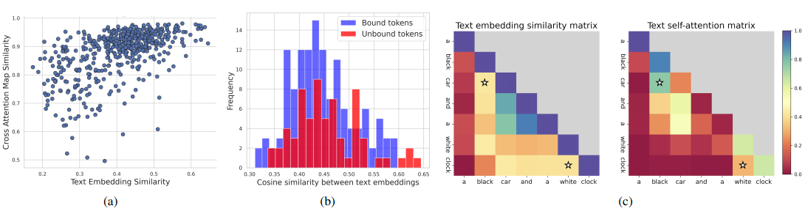
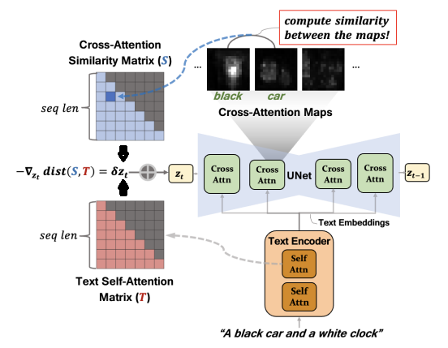

- Paper: Text Embedding is Not All You Need
- Hội nghị: CVPR 2025
- Tóm tắt:
    - Problem: 
        - 1. Missing objects && Attribute Binding
        - 2. Giải quyết các vấn trên mà không dùng External Source (ví dụ: CONFORM (sử dụng thư viện ngoài để phân tách Modifier-Entity),...)
    - Why:

        

        
        

        - Problem 1.
            - Vấn đề với Mô hình Embed (CLIP).
                - **Hoạt động như một BOW** chứ không hiểu mối liên hệ giữa các từ:
                    - Bằng chứng: Phân phối similarity giữa các Bound tokens và Unbound tokens khá giống nhau (trong khi một bên phải thấp - bên còn lại cao)
                    - Lí do: **[Phỏng đoán]** Hiện tượng **Attention Sink**: **Embed output** của mô hình quá tập trung vào các `<bos>` token. 
                - Do đó khi truyền text embed CLIP cho Unet, decoder tự đoán mò quan hệ.
        - Problem 2.
            - Embed từ CLIP không hiểu nên phải truyền thêm thông tin về ngữ nghĩa, có thể từ External để điều hướng **z**.
            - Mặc dù vậy, các **Attention maps do mô hình Embed sinh ra** lại khá **hiểu ngữ nghĩa của câu**.

                Embed của các Bound tokens có cosine similarity gần nhau, còn Unbound Tokens lại xa nhau.
    - Solution:
        - Ý tưởng: Sử dụng Attention maps do mô hình Embed sinh ra để điều hướng **z**.

            

            
            

        - Cụ thể:
            - Xây biến **T** đại diện **mối quan hệ cú pháp giữa các token**, trích xuất từ các lớp Self-Attention của Text Encoder (có thể coi là Attention map giữa các Token):

                $$T' = \frac{1}{L_e H_e} \sum_{\ell=1}^{L_e} \sum_{h=1}^{H_e} T^{(\ell, h)} \rightarrow \mathrm{T}_{ij} = \frac{T'_{ij}}{\sum_{m=2}^{s} T'_{im}}$$
                

                *(Lưu ý: Sau khi cộng trung bình, thực hiện chuẩn hóa hàng (row-wise normalization) và loại bỏ cột đầu tiên để khử ảnh hưởng của **Attention Sink**).*

            - Xây biến **S** đại diện cho **độ tương đồng không gian giữa các token** từ **ảnh đã sinh ra** (Spatial Alignment), được tính toán từ các bản đồ Cross-Attention ($A$):

                - Trước hết, tính độ tương đồng Cosine ($C_{ij}$) giữa các cột $i$ và $j$ của bản đồ Cross-Attention $A$:
                $$C_{ij} = \frac{\sum_{a=1}^{N_c} A_{ai}A_{aj}}{\sqrt{\sum_{a=1}^{N_c} A_{ai}^2} \cdot \sqrt{\sum_{a=1}^{N_c} A_{aj}^2}}$$

                - Sau đó, xây dựng ma trận tương đồng $S$ bằng cách chuẩn hóa theo hàng:
                $$\mathrm{S}_{ij} = \frac{C_{ij}}{\sum_{k=1}^{s} C_{ik}}$$

                *(Lưu ý: $N_c$ là số lượng vị trí không gian (pixel/grid), $s$ là độ dài chuỗi token. Phép chuẩn hóa này giúp $S$ có cùng thang đo phân phối xác suất với ma trận cú pháp $T$, cho phép thực hiện so sánh trực tiếp).*
            - Tối ưu hóa (Optimization): Ép các mối quan hệ trên ảnh ($S$) khớp với cấu trúc cú pháp gốc ($T$) bằng cách tối ưu hóa noise $z_t$ thông qua hàm mất mát (Loss Function):

                $$\mathcal{L}(z_t) = \sum_{i=1, j \le i}^{s} \rho_i |T_{ij}^{\gamma} - S_{ij}(z_t)|$$

                - Trong đó:
                    - $T_{ij}^{\gamma}$ và $S_{ij}(z_t)$: đã định nghĩa ở trên. Tương ứng là quan hệ thực sự giữa các token và quan hệ giữa các token trong ảnh hiện tại.
                    - $\rho_i = i/s$: Càng về sau, các từ càng đóng góp nhiều ngữ nghĩa vào ảnh sinh ra, trừ nặng để tập trung sinh đúng những phần ngữ nghĩa này.

                - Cơ chế hoạt động: Khi áp dụng Gradient Descent ($z'_t = z_t - \alpha \cdot \nabla_{z_t}\mathcal{L}(z_t)$), mô hình sẽ điều chỉnh noise để thay đổi các bản đồ Cross-Attention ($S$), buộc chúng phải "bắt chước" cấu trúc quan hệ ($T$) từ text encoder.

- Nhận xét:
    - Vẫn chậm như các Solution cũ, chỉ là không cần dùng External Resource.

---
   

Tổng kết:

| Paper | Hội nghị | Tóm tắt | Nhận xét |
|:---|:---|:---|:---|
| **Text Embedding is Not All You Need** | CVPR 2025 | - **Problem:** Lỗi liên kết thuộc tính (Attribute Binding) và mất vật thể.     - **Why:** CLIP Embed tập trung vào Attention Sink (`<BOS>`) gây hiểu lầm ngữ nghĩa.  **- Solution:** Điều hướng quá trình denoising ($z_t$) bằng cách tối ưu hóa hàm loss khớp cấu trúc ngữ pháp từ câu gốc ($T$) và từ ảnh đang sinh ra ($S$): $$\mathcal{L}(z_t) = \sum_{i=1, j \le i}^{s} \rho_i \|T_{ij}^{\gamma} - S_{ij}(z_t)\|$$*(Trong đó $\rho_i = i/s$ là trọng số ưu tiên chủ thể, $\gamma$ tăng độ tương phản cú pháp).* | - **Ưu điểm:** Training Free, không External Resource.  - **Nhược điểm:** Vẫn tốn thời gian compute tại mỗi bước inference. |